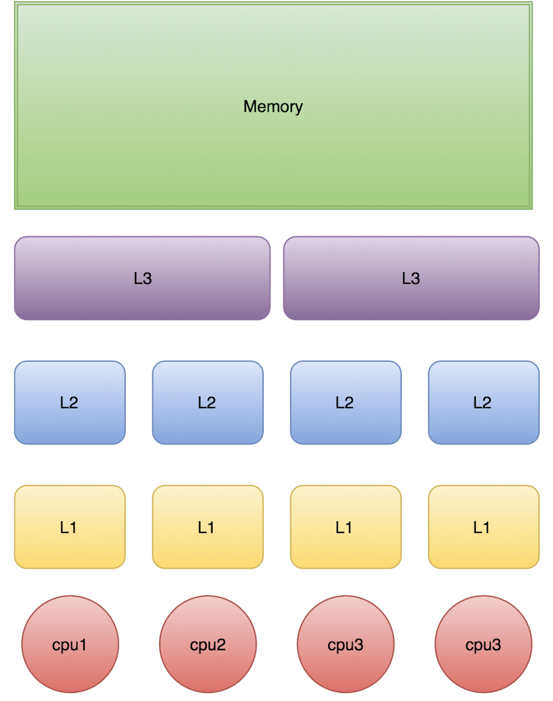

### cpu缓存，伪共享
计算机使用缓存机制加快io速度。

缓存一般是由缓存行(cache line)，一般一行有64字节，读取数据时一次将之后的64字节加载带缓存行，下次可以先从缓存行中获取数据，命中的话
可以提高读取速度，未命中时从上一级缓存获取，直到从内存中获取。

但是也会存在缓存竞争，如果CPU1与CPU2的L1缓存相同，那么他们需要竞争该缓存的使用权，如果CPU1修改了L1缓存，那么会使得CPU2的L1缓存失效。
[缓存测试](CacheLineEffect.java)
[伪共享](FalseSharing.java)

详细介绍可以看以下文章

[Java8使用@sun.misc.Contended避免伪共享](https://www.jianshu.com/p/c3c108c3dcfd)